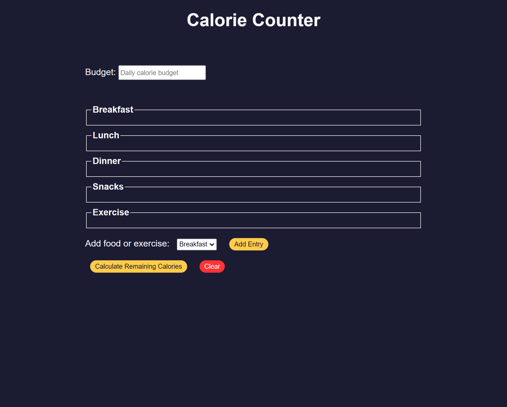

# FreeCodeCamp - Calorie Counter

The project was completed to perform validation of user input, calculations based on that input, and dynamically update the interface to display the results

## Table of contents

- [Screenshot](#screenshot)
- [Links](#links)
- [Author](#author)

### Screenshot

### Links

- Challenge: [Calorie Counter](https://www.freecodecamp.org/learn/javascript-algorithms-and-data-structures-v8/learn-form-validation-by-building-a-calorie-counter/step-1)
- [Live Site URL](https://mariecourse.github.io/calorie-counter/)

## Author

Maria Carrera

